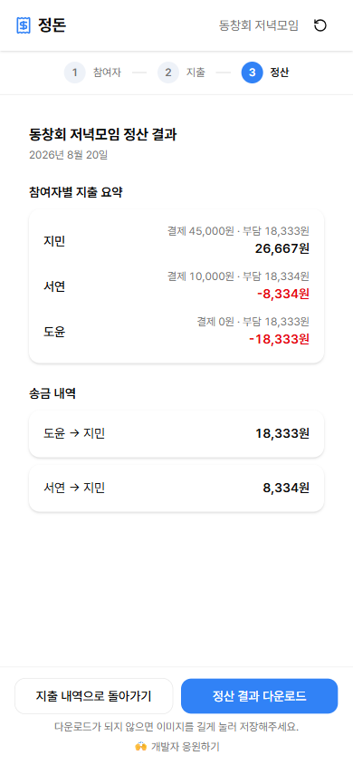

# 정돈 (Split Bill)

가입도 서버도 없이, 복잡한 모임 지출을 그 자리에서 정산해 이미지 한 장으로 공유하는 **로컬 전용 더치페이 계산기**입니다.

🔗 배포 주소: https://split-bill-khaki.vercel.app

## 이런 상황을 위해 만들었어요

인원이 많거나 지출 항목이 복잡해 정산 계산이 번거로운 모임의 **총무**를 위한 도구입니다. 회원가입도, 서버도 없이 브라우저에서 바로 계산하고 결과를 이미지로 저장해 메신저로 공유할 수 있습니다.

## 주요 기능

- **참여자 등록** — 모임 이름(선택)과 참여자 명단을 입력해 정산 세션을 시작
- **지출 항목 입력** — 항목명·금액·결제자를 지정해 지출 내역을 등록
- **배분 방식 지정** — 균등 배분(부담 인원수로 자동 계산) 또는 항목별 배분(참여자마다 실제 부담 금액을 개별 입력) 중 선택
- **지출 항목 목록 관리** — 등록된 지출 항목을 조회·수정·삭제
- **정산 결과 자동 계산** — 참여자별 순잔액을 산출해 **최소 송금 횟수**로 정리된 "누가 누구에게 얼마" 결과를 도출
- **정산 결과 이미지 다운로드** — 결과 화면을 PNG로 저장해 카카오톡 등으로 공유
- **로컬 자동 저장** — 입력한 데이터가 브라우저 localStorage에 자동 저장되어 새로고침해도 유지

## 화면 미리보기

| 참여자 등록 | 지출 내역 | 정산 결과 |
| --- | --- | --- |
|  |  |  |

## 사용 방법

1. **참여자 등록** — 모임 이름(선택)을 입력하고, 참여자 이름을 2명 이상 추가합니다.
2. **지출 추가** — 항목명·금액·결제자를 입력하고, 배분 방식을 선택합니다.
   - **균등 배분**: 부담할 참여자를 체크하면 금액을 인원수로 나눠 자동 계산합니다 (원 단위 내림, 나머지는 결제자가 추가 부담).
   - **항목별 배분**: 참여자별로 실제 부담 금액을 직접 입력합니다. 합계가 지출 총액과 정확히 일치해야 저장할 수 있습니다.
3. 모든 지출을 등록했다면 **정산 결과 보기**를 눌러 참여자별 지출 요약과 "누가 누구에게 얼마" 송금 내역을 확인합니다.
4. **정산 결과 다운로드**로 결과 화면을 PNG 이미지로 저장해 메신저로 공유합니다.

### 알려진 제약

- 모든 데이터는 **이 브라우저(기기)에만** 저장됩니다. 서버가 없으므로 다른 기기나 다른 브라우저와는 공유되지 않고, 브라우저 저장공간을 지우면 함께 사라집니다.
- 정산이 끝나면 **이미지 다운로드**로 결과를 반드시 저장해두세요. 이미지 파일이 유일하게 남는 기록입니다.
- 회원가입/로그인, 정산방 링크 공유, 과거 정산 히스토리 보관, 영수증 첨부, 다중 통화는 지원하지 않습니다 (MVP 범위 밖).
- 모바일 화면 전용으로 제작되어 태블릿/데스크톱 레이아웃은 최적화돼 있지 않고, 다크 모드는 지원하지 않습니다.

## 기술 스택

| 구분 | 기술 |
| --- | --- |
| 빌드/프레임워크 | Vite 8, React 19, TypeScript 6 |
| 라우팅 | React Router 7 (SPA 클라이언트 라우팅) |
| 상태/영속화 | Zustand + `persist` 미들웨어 (localStorage) |
| 폼/검증 | React Hook Form 7, Zod |
| 스타일링/UI | TailwindCSS v4, shadcn/ui, Lucide React |
| 이미지 생성 | html-to-image |
| 배포 | Vercel (정적 SPA) |

## 로컬 개발

```bash
npm install      # 의존성 설치
npm run dev      # 개발 서버 실행
npm run build    # 타입 체크 + 프로덕션 빌드 (dist/)
npm run lint     # ESLint 검사
npm run preview  # 빌드 결과 미리보기
```

단위 테스트 프레임워크는 사용하지 않으며, 배분 계산·정산 알고리즘 등 비즈니스 로직은 Playwright MCP를 이용한 브라우저 시나리오로 검증합니다. 개발 과정과 작업 단위는 [`docs/ROADMAP.md`](docs/ROADMAP.md), 기능 명세와 계산 규칙은 [`docs/PRD.md`](docs/PRD.md)에 정리되어 있습니다.
